# CGCE 원격 Windows Discovery handoff 설계

- 상태: Task 11B 이후 full Gate A 설계로 보류
- 작성일: 2026-07-23
- 적용 범위: 구현 계획 Task 11B의 실 Windows 서버 Discovery 및 Gate A 증거 수집
- 현재 구현 권한: Task 11A는
  `2026-07-23-cgce-windows-discovery-operator-stage-design.md`만 따른다.
  본문의 production composition, native bridge, fatal harness, Gate A `1.1`
  workflow는 Task 11A 범위가 아니며 별도 승인 전 구현·실행하지 않는다.

## 배경

개발과 패키징은 macOS 환경에서 수행하지만, Palworld Dedicated Server와
UE4SS `3.0.1`을 사용하는 실제 Discovery는 별도의 Windows 서버에서만
수행할 수 있다. 테스트 서버는 운영 서버와 다른 포트를 사용할 수 없지만,
운영 서버의 자동 재시작을 중지하고 외부 인바운드 접속을 차단할 수 있다.

따라서 Task 11은 같은 포트를 동시에 공유하는 방식이 아니라, 운영 서버를
완전히 정지한 동안에만 복제 월드를 활성화하는 **동일 포트 직렬 실행**으로
수행한다. 운영 월드 원본에는 Discovery 프로세스를 연결하지 않는다.

현재 `CrossplayGuildChestExpander` 패키지는 결정론적인 Discovery 전용
산출물이며 mutation 기능이 없다. 실제 Palworld symbol과 runtime manifest가
없으므로 production bootstrap도 의도적으로 차단되어 있다. 이 설계는 해당
차단을 우회하지 않고, 정확한 symbol과 Gate A 증거를 안전하게 확보하는
handoff 경로만 추가한다.

## 목표

1. macOS에서 검증 가능한 Windows handoff 번들을 결정론적으로 생성한다.
2. 같은 포트를 쓰더라도 운영 서버와 테스트 서버가 동시에 실행되지 않게 한다.
3. 운영 `Pal\Saved` 전체를 오프라인 백업하고, 테스트에는 검증된 복제본만 쓴다.
4. exact revision, UE4SS `3.0.1`, object/type/function evidence를 읽기 전용으로
   수집해 macOS 개발 환경으로 안전하게 되가져온다.
5. owner가 정확한 후보를 작성한 뒤 별도 observation pass에서 모든 후보를
   exact-match로 검증한다.
6. private evidence와 공개 가능한 binding manifest를 분리하고, 기존 Gate A
   validator로 checksum-bound acceptance를 생성한다.
7. 모든 실패가 운영 서버 자동 시작이나 운영 월드 변경으로 이어지지 않게 한다.

## 비목표

- Windows 방화벽, 라우터, 서비스, watchdog 또는 scheduler를 스크립트가
  자동으로 변경하지 않는다.
- WinRM, SSH, 원격 데스크톱 자동화나 클라우드 전송 채널을 만들지 않는다.
- Palworld symbol을 추측하거나 short name, substring, wildcard로 선택하지 않는다.
- 후보 resize, append, dirty, replication, new-guild 함수를 호출하지 않는다.
- Task 12 mutation engine, Task 13 lifecycle, Task 14 Gate B 인증을 구현하지 않는다.
- Gate A 결과만으로 Steam Windows, PS5, macOS 호환 또는 release 가능성을
  주장하지 않는다.

## 결정

### 선택한 접근: 수동 전송을 사용하는 동일 포트 직렬 handoff

macOS가 source bundle과 SHA-256 sidecar를 만들고, 운영자가 이를 Windows
서버로 수동 복사한다. Windows에서는 운영 서버 정지, 자동 재시작 중지,
외부 인바운드 차단이 선행 조건이다. 도구는 운영 `Saved`를 비활성 이름으로
이동하고 별도 오프라인 백업과 hash inventory를 만든 뒤, 복제본을 활성
`Saved`로 사용한다. 수집 결과는 별도 evidence ZIP과 SHA-256 sidecar로
내보내 macOS에서 검증·가져오기 한다.

이 방식은 별도 포트가 필요 없고, 원격 자격 증명을 추가하지 않으며, 운영
월드와 테스트 월드가 동시에 활성화되는 경우를 구조적으로 차단한다.

### 검토한 대안

1. **운영 월드에서 직접 read-only probe 실행**
   포트와 복사 절차는 단순하지만, 서버 시작 자체가 autosave, 로그, mod
   deployment 등 디스크 변경을 일으킬 수 있다. 백업이 있더라도 운영 원본을
   테스트 프로세스에 노출하므로 채택하지 않는다.
2. **macOS에서 Windows 서버를 원격 제어**
   반복 실행은 편리하지만 WinRM/SSH 자격 증명, 네트워크 노출, 권한 상승,
   환경별 방화벽 제어가 새 보안 범위가 된다. 첫 구현에는 필요하지 않다.
3. **동일 포트 직렬 실행과 수동 artifact handoff**
   운영 중단 시간이 필요하지만, 현재 가능한 자동 재시작 중지와 외부 접속
   차단을 이용해 가장 작은 신뢰 경계를 만든다. 이 안을 채택한다.

## 안전 불변조건

다음 조건 중 하나라도 충족되지 않으면 준비 또는 실행을 거부한다.

1. 대상 `PalServer` 프로세스가 0개이고 game/query/RCON/REST를 포함한 전체
   configured TCP/UDP endpoint set에 기존 listener가 없다.
2. 운영 자동 재시작과 자동 업데이트를 수행할 service, watchdog, scheduler,
   wrapper가 중지되었다는 operator control evidence가 있다.
3. 방화벽 또는 상위 네트워크에서 외부 인바운드가 차단되었다는 operator
   control evidence가 있다.
4. 테스트 실행 인자에 `-publiclobby`가 없고, 운영 플레이어가 모두
   disconnect되었다.
5. 서버가 정지된 상태에서 `Pal\Saved` 전체 파일의 SHA-256 inventory와
   server tree 밖의 별도 backup copy 검증이 완료되었다. backup root는
   server root나 운영/테스트 `Saved`와 alias일 수 없다.
6. 운영 `Saved` 원본과 활성 테스트 `Saved`가 같은 canonical path, file ID,
   junction, symlink 또는 다른 reparse point로 alias되지 않는다.
7. UE4SS가 정확히 `3.0.1`이며 검토된 runtime contract의 파일 hash와 일치한다.
8. Palworld server executable, source commit, handoff bundle, probe request,
   각 evidence artifact의 실제 bytes가 SHA-256으로 연결된다.
9. 실행 중 운영 `Saved` 원본은 이름이 변경된 비활성 경로에 있고 쓰기 대상이
   아니다.
10. 테스트 종료 후에도 도구는 운영 서버를 자동 시작하거나 외부 차단을
    자동 해제하지 않는다.

방화벽, 상위 라우터, Windows service 구성은 서버마다 다르므로 도구가 직접
변경하지 않는다. 대신 operator가 만든 `control-evidence.json`의 정확한 bytes를
run state에 bind한다. 도구가 직접 확인할 수 있는 프로세스, listener, path,
hash 조건은 별도로 다시 검사한다. control evidence가 없거나 만료되었으면
명령행 switch만으로 우회할 수 없다.

`control-evidence.json`은 schema version, maintenance ID, operator,
`scope_kind=qualification|campaign-run`, provisional campaign ID, run ID,
Windows host identity, canonical server root와 volume/file identity, 전체
PalServer listener port set, bundle checksum,
boot-session ID와 monotonic origin, `verified_at_utc`, `valid_until_utc`,
자동 launch/restart/update 차단 방법, 외부 인바운드 차단 방법, 운영 사용자
disconnect 확인을 포함한다. 모든 boolean은 `true`여야 하며 방법 설명은
비어 있을 수 없다.

path에 쓰는 identity는 임의 문자열이 아니다. `campaign_id`, `run_id`,
`maintenance_id`는 각각 `c-`, `r-`, `m-` 뒤에 lowercase hex 32자가 오는
fixed ASCII grammar만 허용한다. private path의 `revision_key`는 canonical
game-revision UTF-8 bytes의 lowercase SHA-256 64자다. Windows와 macOS의 모든
entry point는 path join 전에 길이, exact case, separator/colon 부재와 이 grammar를
검증하며 raw game revision이나 operator 입력을 path component로 사용하지 않는다.
importer와 Gate A validator는 trusted game revision에서 `revision_key`를 각각
재계산해 path component와 exact-match한다.

`verified_at_utc <= current_utc <= valid_until_utc`여야 하고 유효 구간은 최대
4시간이다. tool은 wall clock과 monotonic elapsed time을 함께 기록하고,
clock이 뒤로 이동하면 capture를 차단한다. 시간이 만료되어도 restore는 항상
허용한다. Prepare는 host, canonical root, volume/file identity, port set,
scope/provisional-campaign/run ID, bundle bytes를 evidence와 exact-match한다.
`campaign-run` scope는 아래의 sealed campaign-baseline checksum도 포함해야
한다. 한 maintenance ID의 evidence는 한 run 준비에만 소비하며 다음 run이나
다른 host/path에서 재사용하지 않는다. 실제 통제와 host clock의 신뢰를
유지하는 책임은 operator에게 있고, tool은 그 한계를 run report에 명시한다.

host reboot로 boot-session ID나 monotonic origin이 바뀌면 capture와 resume을
차단하고 새 control evidence를 요구한다. restore는 PalServer/process/listener
정지와 실제 journal identity를 다시 확인한 뒤에만 계속할 수 있다.

maintenance window는 이 control evidence의 첫 통제를 적용한 때 시작하고,
운영 파일의 restore 검증이 끝날 때 종료한다. window 도중 통제 하나라도
해제되면 해당 run은 `BLOCKED`이며 새 maintenance ID와 evidence로 다시
준비해야 한다.

이 문서의 “외부 인바운드 차단”은 public/WAN과 모든 non-allowlisted source를
차단한다는 뜻이다. 실제 inventory/observation/audit/fatal run에는 client
inbound를 하나도 허용하지 않는다. baseline qualification에만 아래에서 정한
한 대의 private maintenance client 예외를 별도 control evidence로 허용한다.

## 아키텍처

### 1. 기존 production Discovery package

`CrossplayGuildChestExpander`는 현재와 같이 release가 아닌 server-only,
mutation-incapable Discovery package로 유지한다. runtime manifest와 검증된
read-only production ports가 준비되기 전에는 production bootstrap이 계속
차단된다. handoff 구현 때문에 이 패키지에 추측 기반 탐색이나 generic UObject
write/call surface를 추가하지 않는다.

### 2. production read-only composition

Pass 3 전에 현재 `main.bootstrap()` 차단을 대체할 production composition을
구현하고 synthetic contract test와 실제 Windows dry run으로 검증해야 한다.
composition은 `cgce.new()`가 요구하는 exact dependency set을 만들며 다음
네 경계로 분리한다.

- UE4SS `3.0.1` read-only port: exact object/type/property read와 hook lifecycle
- reviewed `CGCETrustedIoBridge` native port: Windows handle 기반 package/config/
  manifest read와 private report no-overwrite persistence
- Lua `windows_runtime_files.lua` adapter: native port의 narrow result를
  `cgce.new()` dependency contract로 변환하며 raw path나 generic write API를
  노출하지 않음
- report persistence port: private operational report의 atomic write,
  durable flush, exact read-back receipt

`main.lua`는 composition이 모든 dependency를 검증한 경우에만
`main.bootstrap(dependencies)`를 호출한다. 하나라도 구현·검증할 수 없으면
현재 `CGCE-LOADER-COMPOSITION-UNAVAILABLE` 차단을 유지한다. composition에는
UObject property write, candidate UFunction invocation, game-thread queue,
array mutation, dirty, replication, resize, append가 없어야 한다. 이
deliverable과 package contract test가 없으면 Pass 3은 시작할 수 없다.

stock UE4SS Lua `io.open`/`file:flush`는 reparse-point atomic rejection,
same-handle identity, `FlushFileBuffers`를 제공하지 않으므로 filesystem 보장의
구현으로 인정하지 않는다. `CGCETrustedIoBridge`는 `CreateFileW`와 handle
identity 검증으로 contained regular file을 same-handle read하고, report는
same-volume exclusive temp handle에 write/`FlushFileBuffers`/read-back한 뒤
no-replace write-through rename으로 publish하는 두 operation만 노출한다.
게임 UObject, process/service, network 또는 임의 filesystem mutation API는
노출하지 않는다. coordinator가 만든 run ID, nonce, canonical root identity와
bundle checksum이 모두 일치해야 operation을 허용하며 source/build recipe와
실제 DLL checksum을 source manifest, run request와 campaign manifest에 bind한다.

production composition이 manifest의 revision 값을 그대로 돌려주는 구현은
허용하지 않는다. observation review 뒤 생성하는
`revision-source-binding.json`은 exact `source_kind`,
`exact_source_identity`, owner/path/signature, normalization rule, UE4SS read
operation, observation-core/revision-evidence checksum과 expected game revision을
canonical하게 bind한다. audit bundle coordinator가 이 private descriptor를
manifest 선택 전에 native read-only port에 전달하고, composition은 그 exact
source에서 live revision을 읽은 뒤에만 해당 revision의 runtime manifest를
선택한다. runtime manifest `1.1`은
`revision_source_binding_checksum`을 필수로 갖고 production report도 같은
checksum과 실제 observed source identity/value를 기록한다. descriptor 누락,
불일치, fuzzy source 선택, manifest revision 자기반환은 모두 bootstrap을
차단한다. Gate A는 descriptor가 reviewed observation의 revision evidence와
field-for-field 같은지 검증한다.

`exact_source_identity`가 file source일 때는 host absolute path가 아니라
coordinator가 검증한 canonical server root 기준의 fixed relative path만
허용한다. reflection source일 때는 exact reflected full path/signature를 쓴다.

### 3. 격리된 `CGCEDiscoveryProbe`

별도의 비-release Windows handoff package로만 배포한다. 첫 pass에서는
UE4SS object/UHT dump와 runtime identity만 수집한다. 두 번째 pass에서는
owner가 작성한 exact `probe-request.json`만 읽고 다음 범위만 허용한다.

- exact `StaticFindObject`로 UClass를 먼저 검증
- 검증된 UClass handle에서 exact short class name을 얻어
  `FindAllOf(short_class_name)`에 전달하고 결과를 loaded-instance inventory로만 사용
- `IsValid`, `GetFullName`, `GetClass`
- read-only reflection 및 property metadata 조회
- 이미 exact path와 signature가 검토된 world-ready 함수의
  `RegisterHook`/`UnregisterHook`

probe source에는 property write, `__newindex`, `SetPropertyValue`,
`CallFunction`, `ProcessConsoleExec`, `ExecuteInGameThread`, `TArray` 변경,
object/slot 생성, dirty, replication, resize, append가 존재할 수 없다.
static package contract test가 이 금지 surface를 검사한다.

### 4. 격리된 fatal-safety harness

fatal no-save 또는 safe-stop 기능의 실제 동작 증명은 일반 probe와 분리한다.
정확한 후보와 signature가 사람에게 검토되고 candidate request checksum이
승인된 후에만 별도 `CGCEFatalSafetyHarness` 번들을 생성할 수 있다. 이
harness는 복제 월드에서 단 하나의 checksum-pinned fatal function만 실행하며,
일반 Discovery observation과 runtime manifest에는 후보 호출을 성공 근거로
기록하지 않는다.

fatal harness가 쓰는 `fatal-execution-transcript.json`은 invariant 감지부터
save-attempt 차단과 safe-stop/no-save 결과까지의 probe-owned ordered event
sequence만 기록한다. 별도 Windows coordinator가 process identity, wall-clock과
monotonic time, save-tree 전후 상태를 `fatal-telemetry.json`으로 기록한다.
두 artifact와 실제 filesystem/process 관측이 모두 converge하지 않으면 Gate A는
계속 차단된다.

### 5. Windows operator tools

PowerShell 도구는 공통 모듈을 사용하되 역할별 entry point를 분리한다.
Production operator scripts는 Windows PowerShell `5.1` 호환 syntax와 .NET
API만 사용하고 PowerShell `7.x`에서도 같은 fixture를 통과해야 한다.

- `Prepare-CgceDiscovery.ps1`
  - bundle/contract/control evidence hash 검증
  - 프로세스·listener·disk space·path/reparse-point preflight
  - 전체 `Pal\Saved` offline backup 및 file inventory 검증
  - 운영 `Saved`를 비활성 보존 경로로 이동
  - qualification은 방금 검증한 운영 backup에서, 이후 evidence run은
    sealed campaign baseline tree에서 활성 테스트 `Saved` clone 생성
  - `PalModSettings.ini`와 대상 Workshop/ManagedMods/NativeMods 상태 백업
  - 선택한 probe package를 idempotent하게 staging
- `Invoke-CgceDiscovery.ps1`
  - 준비 상태와 직렬 실행 조건 재검증
  - `-publiclobby`와 secret-bearing launch argument 거부
  - operator가 지정한 exact server executable을 직접 한 번만 실행
  - 대상 process와 listener를 run state에 기록
  - capture 완료 또는 timeout 후 server stop을 요구
- `Seal-CgceCampaignBaseline.ps1`
  - qualification run에서만 실행
  - server/client 정지와 fixture attestation, stable recursive save inventory 검증
  - qualified clone을 server tree 밖 ACL-restricted campaign storage의 staging에
    no-follow copy하고 hash/file-ID 검증 후 immutable baseline tree로 final rename
  - baseline tree identity/inventory와 qualification provenance를 담은 immutable
    `campaign-baseline.json`을 atomic write/durable flush/read-back
- `Export-CgceEvidence.ps1`
  - PalServer가 완전히 정지된 경우에만 실행
  - acceptance용 export는 `phase=COMPLETION_SEALED`,
    `outcome=ACTIVE`와 role-qualified run-completion receipt가 검증된 뒤에만 생성
  - run kind별 allowlist 파일만 수집
  - save/config/credential 파일과 reparse point를 거부
  - canonical evidence manifest, ZIP, 외부 SHA-256 sidecar 생성
  - restore 미완료/실패 시에는 acceptance와 파일명·schema가 분리된 diagnostic
    export만 허용하며 Gate A import/materialization 대상이 될 수 없음
- `Restore-CgceProduction.ps1`
  - PalServer와 listener가 없는지 다시 검증
  - 테스트 `Saved`를 삭제하지 않고 quarantine으로 이동
  - 비활성 운영 `Saved`의 file inventory가 준비 시점과 같은지 검증
  - 운영 `Saved`, `PalModSettings.ini`, mod 배치 상태를 exact bytes로 복원
  - 시작 전과 복원 후 운영 inventory, `RESTORED` state snapshot checksum과
    그 시점까지의 journal prefix checksum을 묶은 role-qualified
    run-completion receipt를 no-overwrite 생성
  - 운영 server는 시작하지 않고 외부 차단도 유지

원본 backup, 운영 `Saved`, 테스트 quarantine은 operator가 복구 성공을
확인하기 전까지 삭제하지 않는다. 같은 명령을 다시 실행할 때는 run state와
실제 filesystem 상태가 정확히 일치하는 경우에만 resume하며, 불명확한
상태에서는 fail closed한다.

### 6. macOS build/import 및 Gate A tools

- `scripts/build-discovery-handoff.sh`
  - clean tracked commit만 사용하고 dirty worktree에서는 거부
  - deterministic ZIP과 SHA-256 sidecar 생성
  - production Discovery package, 격리 probe/harness source, PowerShell tools,
    JSON schemas, source manifest 포함
  - run kind에 따라 owner가 명시한 private `probe-request.json`,
    `binding-manifest.json`, `revision-source-binding.json`,
    `fatal-approval.json`, `fatal-approval-authorization.json`,
    `fatal-save-policy.json`만 external input으로 허용
  - fatal bundle은 approval과 pre-run authorization의 실제 bytes checksum 및
    별도 채널로 받은 두 explicit SHA-256 pin이 각각 같고, approval이 bind한
    fatal-save-policy checksum도 actual policy bytes와 같을 때만 생성
  - external input은 dedicated contained input root와 exact basename/pin으로만
    선택하고, component-wise no-follow open, regular file, link count 1,
    strict canonical schema를 검증
  - 같은 open handle에서 hash와 copy를 수행해 no-overwrite immutable staging에
    durable write/read-back한 bytes만 bundle builder에 전달
  - 각 external input의 bytes/checksum을 tracked source manifest와 분리해 기록
  - 명시한 pass input 외의 private evidence, saves, credentials, test runtime,
    release-only mutation source 제외
- `scripts/import-gate-a-evidence.sh`
  - outer checksum을 extraction 전에 검증
  - absolute path, `..`, drive prefix, ADS, symlink, hardlink, reparse metadata,
    duplicate canonical name, case-fold collision 거부
  - run kind별 exact allowlist와 내부 checksum 검증
  - `inventory`는 최대 64 entries, 파일당 2GiB, 총 4GiB, compression ratio
    250:1; 나머지 run은 최대 64 entries, 파일당 256MiB, 총 1GiB, ratio
    100:1로 제한
  - destination free space가 declared total uncompressed size의 두 배와
    추가 1GiB를 합한 값보다 작으면 extraction 거부
  - temp quarantine으로 streaming extract하며 한도 초과/부분 extraction은
    acceptance 입력으로 승격하지 않음
  - 기존 디렉터리 overwrite 없이
    `private-artifacts/discovery-imports/{revision_key}/{campaign_id}/{run_id}/`으로
    quarantine import
- `scripts/materialize-gate-a-review.sh`
  - operator가 checksum으로 선택한 campaign/run manifest의 exact regular-file
    bytes만 선택
  - nested import를 validator의 canonical flat workspace
    `private-artifacts/discovery/{revision_key}/{campaign_id}/`에 no-overwrite copy
  - campaign ID와 campaign-manifest checksum을 별도 CLI pin으로 받아 기존
    revision의 다른 campaign workspace와 절대 병합하지 않음
  - source와 destination을 다시 hash하고 link/reparse/file-ID alias를 거부
  - final observation과 private runtime manifest를 atomic temp-write와 durable
    flush 후 materialize
  - reviewer identity나 attestation이 없는
    `gate-a-review-input.json` artifact inventory까지만 생성
- `scripts/finalize-gate-a-review.sh`
  - independent review가 끝난 후 reviewer identity, reviewed-at, 다섯
    attestation, 별도 채널로 받은 `gate-reviewer-authorization.json`과 그
    explicit SHA-256 pin을 입력받음
  - pre-run fatal approval와 fatal-approval authorization의 explicit pin도
    별도 입력으로 받아 materialized actual bytes와 각각 exact-match
  - authorization artifact의 실제 bytes가 CLI pin과 같을 때만 strict
    `P/gate-a-evidence.json`을 생성하고, authorization actual bytes와
    trusted-input은 별도 `T` root에 same-fd no-overwrite 저장
  - materialized artifact가 review-input checksum 이후 바뀌었으면 거부
- Gate A acceptance CLI
  - vendored Lua `5.4.8` validator와 repository-owned
    `tools/gate-a/trusted_io.py` coordinator 사용
  - coordinator는 explicit Python interpreter real path/version/hash를 toolset
    manifest와 CLI pin으로 검증하고 shell 없이 vendored Lua child를 실행
  - canonical workspace 밖의 별도 trusted-input 파일에서 revision, world,
    reviewer, reviewed-at, review-request checksum, Gate reviewer authorization
    checksum을 받으며 review request 자체에서 이 값을 추론하지 않음
  - trusted-input, post-run Gate reviewer authorization, pre-run fatal approval와
    fatal-approval authorization checksum을 각각 별도 CLI pin으로 다시 받아
    workspace 파일만으로 승인을 자가 생성할 수 없게 함
  - coordinator가 root dirfd부터 각 component를 `openat`/`O_NOFOLLOW`로 열고
    `fstat`, regular file, link count, device/inode를 검증한 같은 fd의 bytes를
    length-framed stdin으로 Lua validator에 전달하며 Lua는 path를 다시 열지 않음
  - 기존 receipt가 있으면 거부하고 private `gate-a-acceptance.json`을
    coordinator가 dirfd-relative exclusive temp write, file/directory fsync,
    no-replace rename, same-fd exact read-back으로 publish한 뒤 그 bytes와 원본
    artifact bytes를 다시 stream해 실제 `gate_a_evidence.verify`를 재실행
  - public binding manifest와 release archive를 자동 생성하지 않음

stock Lua `io.open`을 no-follow port로 감싸는 구현은 허용하지 않는다.
build/materialize/finalize도 같은 trusted-I/O coordinator의 contained-root,
same-fd read/copy/write primitive를 재사용한다. Python coordinator가 없는
환경이나 interpreter/toolset pin이 다르면 Gate A를 생성하지 않는다.

## 데이터 흐름

```mermaid
flowchart LR
    A["macOS: deterministic handoff bundle"] -->|"ZIP + SHA-256 수동 복사"| B["Windows: serial test session"]
    B --> Q["Qualification + sealed baseline"]
    Q --> C["Inventory evidence"]
    C -->|"private ZIP + SHA-256"| D["macOS: owner candidate review"]
    D --> E["Exact probe request"]
    E -->|"next checksum-bound bundle"| F["Windows: observation core + trusted audit"]
    F --> G["macOS: runtime manifest + fatal approval"]
    G --> H["Windows: production audit + fatal proof"]
    H -->|"role-specific private bundles"| I["macOS: safe import + observation finalization"]
    I --> J["Canonical materialization + independent review"]
    J --> M["Review finalization + Gate A validator"]
    M --> K["Private acceptance receipt"]
    K --> L["Promote exact reviewed ID-free binding + revision-source bytes"]
```



모든 화살표는 수동 복사여도 source와 destination에서 같은 실제 bytes를
SHA-256으로 검증한다. 파일 이름이나 ZIP 내부 checksum 문자열만 신뢰하지 않는다.

## Gate A provenance contract 강화

현재 Gate A `1.0`은 canonical flat path와 artifact 간 내용 convergence는
검증하지만, 여러 Windows run이 같은 campaign/baseline에서 왔는지와 fatal
behavior의 외부 관측 telemetry를 receipt에 bind하지 않는다. 실제 Task 11
acceptance에는 private evidence/acceptance contract `1.1`을 도입한다. 이는
Gate A를 완화하는 변경이 아니라 provenance를 추가하는 강화다.

`1.1` review request는 기존 artifact role에 다음 role을 추가한다.

- `campaign_baseline`
- `campaign_manifest`
- `qualification_export_manifest`
- `inventory_export_manifest`
- `observation_export_manifest`
- `audit_export_manifest`
- `fatal_export_manifest`
- `observation_core`
- `trusted_audit`
- `revision_source_binding`
- `fatal_approval`
- `fatal_approval_authorization`
- `fatal_save_policy`
- `fatal_save_scope_attestation`
- `fatal_telemetry`

`1.1` schema, importer, materializer와 validator는 하나의
`artifact_path_map` 상수를 공유한다. `P`는 정확히
`private-artifacts/discovery/{revision_key}/{campaign_id}`이며 다음 mapping
밖의 role/path는 거부한다.

| role | exact path |
|---|---|
| `probe_request` | `P/probe-request.json` |
| `discovery_observation` | `P/discovery-observation.json` |
| `operational_report` | `P/operational-report.json` |
| `runtime_manifest` | `P/binding-manifest.json` |
| `revision_source` | `P/revision-source.log` |
| `projection_contract` | `CrossplayGuildChestExpander/Scripts/discovery_evidence.lua` |
| `projector_implementation` | `CrossplayGuildChestExpander/Scripts/snapshot.lua` |
| `capture_source` | `CrossplayGuildChestExpander/Scripts/audit.lua` |
| `durability_codec` | `CrossplayGuildChestExpander/Scripts/fingerprint.lua` |
| `metadata_codec` | `CrossplayGuildChestExpander/Scripts/json.lua` |
| `metadata_ordered_input_contract` | `CrossplayGuildChestExpander/Scripts/sha256.lua` |
| `fatal_behavior_proof` | `P/fatal-behavior-proof.json` |
| `fatal_harness` | `P/fatal-harness.lua` |
| `fatal_execution_transcript` | `P/fatal-execution-transcript.json` |
| `campaign_baseline` | `P/campaign-baseline.json` |
| `campaign_manifest` | `P/campaign-manifest.json` |
| `qualification_export_manifest` | `P/qualification-export-manifest.json` |
| `inventory_export_manifest` | `P/inventory-export-manifest.json` |
| `observation_export_manifest` | `P/observation-export-manifest.json` |
| `audit_export_manifest` | `P/audit-export-manifest.json` |
| `fatal_export_manifest` | `P/fatal-export-manifest.json` |
| `observation_core` | `P/observation-core.json` |
| `trusted_audit` | `P/trusted-audit.json` |
| `revision_source_binding` | `P/revision-source-binding.json` |
| `fatal_approval` | `P/fatal-approval.json` |
| `fatal_approval_authorization` | `P/fatal-approval-authorization.json` |
| `fatal_save_policy` | `P/fatal-save-policy.json` |
| `fatal_save_scope_attestation` | `P/fatal-save-scope-attestation.json` |
| `fatal_telemetry` | `P/fatal-telemetry.json` |

canonical workspace workflow files는 `P/gate-a-review-input.json`,
`P/gate-a-evidence.json`, `P/gate-a-acceptance.json`으로 고정한다. 별도 trusted
root `T=private-artifacts/discovery-trust/{revision_key}/{campaign_id}`를 두고,
post-run authorization과 trusted input은 각각 정확히
`T/gate-reviewer-authorization.json`,
`T/gate-a-trusted-input.json`에만 no-overwrite 저장한다. materializer는 `T`를
쓰지 않으며 acceptance CLI는 P와 T를 서로 다른 dirfd/root identity로 검증한다.
runtime manifest는 acceptance 전까지 `P/binding-manifest.json`에서만
검증한다. acceptance 후 같은 bytes/checksum의 binding과 ID-free
revision-source binding만 각각 기존 public binding path와 checksum-addressed
`Scripts/revision_sources/` path로 no-overwrite 승격한다.

`campaign-baseline.json`은 qualification이 끝난 뒤 sealed된 provisional
campaign ID, world/revision, Saved inventory checksum, PalServer/UE4SS/source
identity와 immutable qualification run-request checksum을 고정한다.

qualification export manifest는 `campaign-baseline.json`, qualification
control evidence, run request와 run-completion의 실제 bytes/checksum을 bind한다.
qualification의 gameplay 변경이나 로그 자체는 포함하지 않는다.

`campaign-manifest.json`은 campaign ID, frozen baseline checksum, exact
world/revision, PalServer executable checksum, UE4SS `3.0.1` reviewed file-set
checksum, source commit, role별 bundle/export manifest checksum, run ID,
control-evidence checksum, artifact checksum을 canonical하게 연결한다.
validator는 다섯 export manifest의 실제 bytes를 읽고 각 artifact가 선언된 run에서
나왔는지 역검증한다. 동일 revision/world라도 campaign, baseline, runtime,
bundle 또는 run role이 다르면 acceptance를 거부한다.

각 run은 실행 전에 immutable `run-request` object를 가진다. 이 object는
run ID/kind, campaign-baseline checksum, bundle, control evidence, exact
external input checksum을 bind하고 해당 export manifest 안에 canonical
object와 checksum으로 포함된다. materializer는 export manifest가 가리키는
exact control-evidence와 run-request bytes도 Windows export 시점부터 다음
role-qualified strict filename으로 만들며, materializer는 이름을 바꾸지 않고
복사한다.

단, qualification run-request는 아직 존재하지 않는 baseline checksum을
포함하거나 참조해서는 안 된다. 대신 provisional campaign ID, stable base
source/toolset, qualification bundle과 control-evidence checksum만 bind한다.
sealed `campaign-baseline.json`과 qualification export manifest가 그 request
checksum을 단방향으로 bind한다. 이후 네 evidence run-request만 sealed
campaign-baseline checksum을 필수로 bind한다.

- `qualification-control-evidence.json`
- `qualification-run-request.json`
- `qualification-run-completion.json`
- `inventory-control-evidence.json`
- `inventory-run-request.json`
- `inventory-run-completion.json`
- `observation-control-evidence.json`
- `observation-run-request.json`
- `observation-run-completion.json`
- `audit-control-evidence.json`
- `audit-run-request.json`
- `audit-run-completion.json`
- `fatal-control-evidence.json`
- `fatal-run-request.json`
- `fatal-run-completion.json`

각 export manifest, Gate A `1.1` path table과 private artifact allowlist는 이
exact name을 요구한다. Gate A validator는 각 파일의 실제 bytes를 다시 읽어
role, run ID, checksum을 역검증한다. 각 export manifest는 해당
run-completion checksum을 필수로 bind하고 final campaign manifest와
acceptance receipt가 다섯 checksum을 다시 bind한다.

pre-run `fatal-save-policy.json`은 root-independent relative-path policy다.
campaign baseline/config checksum을 bind하고 `SaveGames` 전체 subtree를
authoritative zero-diff scope로, exact `Logs`, `Crashes`와 probe-owned output
relative root만 volatile diagnostic scope로 분류한다. 그 밖의 Saved path는
변경 허용 목록이 아니라 unexpected-write scope다. fatal approval은 이 policy
checksum을 승인한다.

Prepare가 exact fatal bundle을 검증하고 active clone을 만든 뒤, 실행 전
`fatal-save-scope-attestation.json`을 no-overwrite 생성한다. 이 attestation은
policy checksum, actual canonical `Pal\Saved` root volume/file identity,
active clone/config checksum과 campaign/run/bundle identity를 bind한다.
trigger 직전 stable inventory는 실행 중 coordinator telemetry가 별도로
수집한다. attestation은 approval이나 bundle이
역참조하지 않으며 fatal telemetry와 export manifest가 단방향으로 bind한다.

`fatal-telemetry.json`은 Windows coordinator가 외부에서 관찰한 process ID와
creation time, executable checksum, candidate/harness checksum,
campaign-baseline checksum과 fatal run-request checksum,
armed/trigger/exit wall-clock 및 monotonic time, trigger 직전과 process 종료
후의 full Saved inventory와 change-event transcript checksum,
fatal-save-policy/scope-attestation checksum, normal-save/autosave attempt provenance,
probe transcript checksum을 포함한다. validator는 `SaveGames` 안의 생성,
삭제, content change, rename과 같은-volume replace/temp/backup entry까지
zero-diff인지 확인하고, unexpected-write scope의 변화도 거부한다. volatile
diagnostic scope의 변화는 별도 inventory로 보존하되 no-save 성공 근거로
계산하지 않는다. validator는 이를 fatal proof, execution transcript, harness,
selected candidate, campaign manifest와 cross-check한다. self-declared
boolean이나 `save_write_count=0`만으로 fatal behavior를 승인하지 않는다.
change-event watcher는 process 시작 전에 arm하고 sequence gap, buffer overflow,
watcher restart 또는 root identity change가 한 번이라도 있으면 fatal proof를
거부한다. pre/post zero-diff만으로 중간 write 후 원복을 성공 처리하지 않는다.

fatal telemetry와 proof는 아직 존재하지 않는 final campaign-manifest checksum
또는 fatal export-manifest checksum을 역참조하지 않는다. final campaign
manifest가 pre-run baseline/request와 post-run export/telemetry를 단방향으로
묶어 checksum cycle을 방지한다. validator는 `fatal_approval`과 별도
authorization artifact/pin도 실제 bytes로 읽어 candidate, harness, core,
baseline, run request, reviewer identity가 converge하는지 검증한다.

`1.1` acceptance receipt는 campaign manifest checksum, 다섯 run ID와 export
manifest checksum, observation-core checksum,
trusted-audit content/artifact checksum, fatal approval와 authorization
checksum, post-run Gate reviewer authorization checksum,
fatal-save-policy/scope-attestation/fatal-telemetry checksum,
다섯 run-completion checksum을
추가한다. receipt는 계속
`status=ACCEPTED_READ_ONLY_EVIDENCE`,
`mutation_capability=false`, `release_eligible=false`,
`behavior_authorized=false`다. 실제 Task 12 authorization에서 `1.1`은 필수
전제일 뿐 충분조건이 아니다. production apply는 별도의 fresh live audit,
exact world/revision/profile, operator approval, verified fatal guard와
pinned Gate B가 모두 있어야 한다. Gate B 자체를 만들기 위한 allowlisted
disposable-world certification apply만 Task 12의 별도 checksum-bound
`certification_mode` 예외로 Gate B 전에 허용하며, production build에서는
이 mode를 거부한다. 기존 `1.0` fixture는 parser regression 용도로만 남기며
mutation 구현 시작이나 authorization authority가 될 수 없다.
`scripts/verify-package.sh`와 `scripts/build-release.sh release`도 `1.0`
receipt를 Gate A 충족으로 인정하지 않는다.

raw import는 run별 nested quarantine에 보존하지만 validator 입력은
`private-artifacts/discovery/{revision_key}/{campaign_id}/`의 campaign-scoped
canonical flat validation workspace로 materialize한다. CLI는 campaign ID와
campaign-manifest checksum을 모두 exact pin하며, 같은 revision의 다른 campaign
workspace를 재사용·병합하지 않는다. 모든 private filename은 strict allowlist를
사용한다. runtime manifest도 acceptance 전에는 이 private workspace의
`binding-manifest.json`으로 검증하며, acceptance 후 같은 checksum의 bytes만
`CrossplayGuildChestExpander/Scripts/bindings/{revision}.json`과
`CrossplayGuildChestExpander/Scripts/revision_sources/{checksum}.json`으로
각각 no-overwrite 승격한다.

## Discovery campaign과 실행 상태

qualification 시작 전에 opaque provisional `campaign_id`를 할당한다.
qualification이 끝나 `campaign-baseline.json`을 seal한 뒤에만 다음 identity가
고정된 조사 campaign이 된다.

- Palworld exact game revision과 authoritative revision source
- PalServer executable hash
- UE4SS version 및 reviewed file hash set
- handoff source commit, private input을 제외한 stable base source-manifest와
  toolset checksum
- frozen baseline backup checksum

각 concrete bundle은 run kind와 private input이 달라 checksum도 다르다. 해당
bundle checksum은 campaign 공통 identity가 아니라 immutable run request에
기록하고 final campaign manifest가 role별로 모은다.

각 Windows 실행은 별도 `run_id`와 `run_kind`를 갖는다.

- `qualification`: representative fixture 생성·검증과 baseline seal
- `inventory`: object/UHT dump 및 runtime identity
- `observation`: exact probe request에 대한 non-invoking observation
- `audit`: production Discovery runtime의 ownership/snapshot audit
- `fatal-capability`: 별도 승인된 fatal behavior harness

`qualification`도 나머지 run과 같은 backup/deactivate/clone/journal/guard/
restore 상태 모델을 사용한다. 다만 control evidence는
`scope_kind=qualification`과 provisional campaign ID를 사용하고 아직 존재하지
않는 baseline checksum을 요구하지 않는다. 이후 네 evidence run은
`scope_kind=campaign-run`과 sealed baseline checksum을 반드시 사용한다.

각 run은 server tree 밖의 ACL-restricted run root에 filesystem 변경 전
`CREATED` record를 먼저 atomic write하고 durable flush한다. phase는 다음
순서만 허용한다.

```text
CREATED
  -> GUARD_ARMED
  -> BACKUP_VERIFIED
  -> ORIGINAL_DEACTIVATED
  -> CLONE_ACTIVE
  -> MOD_STAGED
  -> RUNNING
  -> CAPTURED
  -> RESTORING
  -> RESTORED
  -> COMPLETION_SEALED
  -> EXPORTED
```

run state는 `phase`와 `outcome`을 분리한다. `outcome`은 `ACTIVE`,
`SUCCEEDED`, `BLOCKED` 중 하나다. 실패하면
`outcome=BLOCKED`와 stable error code를 기록하되 현재 `phase`는 보존한다.
`BLOCKED`에서는 process가 완전히 정지된 상태의 별도 diagnostic export와
explicit restore만 가능하고, 다음 capture나 production start는 허용하지
않는다. restore 검증의 일부로 completion receipt를 seal할 수 있지만
acceptance export는 금지된다. diagnostic export는 phase를 `EXPORTED`로
바꾸지 않는다.
restore가 끝나면 `phase=RESTORED`가 되지만 `outcome=BLOCKED`는 유지된다.
복원 전후 inventory와 journal tail을 검증해 role-qualified run-completion을
no-overwrite seal한 뒤에만 `COMPLETION_SEALED`로 전환한다. `SUCCEEDED`는
capture, restore, completion과 acceptance export까지 검증된 `EXPORTED`에서만
기록한다.

run-completion의 state checksum은 변경 가능한 terminal state가 아니라,
receipt 생성 직전의 exact `RESTORED` state snapshot과 journal prefix를
가리킨다. 이후 `COMPLETION_SEALED`/`EXPORTED` phase와 `SUCCEEDED` 표시는
operator 진행 상태일 뿐 Gate A authority가 아니다. Gate A는 immutable
run-completion과 export manifest의 실제 bytes/checksum을 검증한다.

각 rename/copy/staging/restore 전에 write-ahead journal entry를 durable
flush한다. entry는 operation ID, source/destination canonical path,
volume/file ID, pre-hash, intended postcondition을 포함한다. 작업 후 실제
handle identity와 hash를 다시 읽은 뒤 completion entry를 flush한다. crash
recovery는 journal과 실제 tree를 함께 판정한다.

- inactive original만 있고 active `Saved`가 없으면 original을 atomic rename한다.
- inactive original과 partial active clone이 있으면 clone을 새 no-overwrite
  quarantine으로 이동한 뒤 active path가 비었음을 확인하고 original을 복원한다.
- active/inactive가 alias이거나 original 후보가 둘 이상이거나 identity/hash가
  journal과 다르면 자동 덮어쓰기 없이 수동 복구로 차단한다.
- mod staging의 partial state도 exact before-image가 있을 때만 복원한다.

active `Saved`, inactive original, clone staging, test quarantine은 atomic
directory rename이 보장되도록 같은 NTFS volume에 있어야 한다. 별도 backup
root는 다른 volume일 수 있으며 이 경우 atomic move를 가정하지 않고
copy-to-staging, recursive hash/file-ID 검증, final rename 순서만 사용한다.

각 pass 후 운영 서버를 다시 서비스해야 한다면 restore, completion seal과
acceptance export를 끝내 `EXPORTED`까지 완료한다.
다음 pass는 같은 frozen campaign baseline의 새 clone을 사용한다. 그 사이
production world가 진행되어도 evidence는 campaign baseline checksum에 묶인다.
다음 pass를 준비할 때도 현재 운영 `Saved` 전체를 별도 run-local backup으로
먼저 보존한 뒤 활성 경로에서 분리한다. campaign baseline을 재사용한다는 이유로
그 시점의 운영 원본 backup을 생략하지 않는다. PalServer executable, game
revision 또는 UE4SS hash가 바뀌면 기존 campaign을 재사용하지 않고 새
inventory campaign부터 시작한다.

모든 Saved/backup/clone/staging/quarantine/mod tree는 root 검사만 하지 않고
recursive handle-based no-follow traversal을 수행한다. nested reparse point를
거부하고, enumerate한 path를 handle로 연 뒤 volume/file ID를 재확인하며,
source와 모든 destination tree 사이에 같은 `(volume,file ID)`가 한 번도
재사용되지 않음을 증명한다. hardlink는 reparse point가 아니므로 이 file-ID
중복 검사로 별도 차단한다.

모든 operator entry point는 canonical server root와 volume identity에서 만든
ACL-restricted system mutex를 획득한다. filesystem 활성화/복원 직전과 직후
PalServer process와 전체 configured endpoint를 다시 검사한다. Invoke는 자신이
시작한 exact child PID, creation time, image path와 checksum을 pin하고 TCP/UDP
endpoint owning PID를 종료까지 감시한다. 다른 PID나 image가 나타나면 capture를
`BLOCKED`로 전환하고 모든 PalServer process가 멈출 때까지 restore를 허용하지
않는다.

mutex는 외부 watchdog을 막지 못하므로 `CREATED` 직후 process/endpoint guard를
먼저 arm하고 zero-process/zero-listener 상태를 검증한 뒤
`GUARD_ARMED`로 전환한다. 이 guard는 offline backup/inventory,
`ORIGINAL_DEACTIVATED`, `CLONE_ACTIVE` 검증이 모두 끝날 때까지 연속 유지한다.
`RESTORING`도 rename 전에 별도 guard를 arm하고 original activation 검증까지
유지한다. foreign PID/bind가 나타나면 즉시 이후 rename을 중단하고
`outcome=BLOCKED`, `error_code=CGCE-OPS-MANUAL-RECOVERY`로 전환한다.

## 세부 조사 절차

### Campaign baseline qualification

Gate A capture 전에 candidate clone이 다음 representative fixture를 모두
갖는지 확인한다.

- initialized 54-slot guild chest 하나
- chest가 아직 없는 guild 하나
- ownership 비교가 가능한 서로 다른 guild 둘 이상
- 제외를 증명할 일반 non-guild container 하나
- 54-slot chest 안의 occupied slot과 empty slot

운영 clone에 이미 모두 있으면 server를 멈추고 그 bytes를 frozen baseline으로
봉인한다. 빠진 fixture가 있으면 read-only probe나 save editor로 만들지 않는다.
별도의 pre-capture qualification session에서 public/WAN traffic은 계속 차단하고,
정확히 한 대의 allowlisted operator-owned vanilla Steam Windows client만
접속시켜 정상 gameplay로 test clone에 만든다. 이후 client와 server를 종료하고
전체 save inventory를 새 baseline으로 봉인한다. 이 통제된 client 경로를
제공할 수 없으면 campaign은 `CGCE-CAMPAIGN-FIXTURE-MISSING`으로 차단된다.
qualification session의 변경이나 로그는 Gate A evidence가 아니다.

qualification 종료 후 coordinator는 server/client가 모두 꺼지고 test clone의
recursive inventory가 안정적인지 확인한다. qualified clone은 server tree 밖의
ACL-restricted campaign storage에 copy-to-staging, recursive hash/file-ID 검증,
final no-overwrite rename 순서로 보존한다. 그 baseline tree를 가리키는
`campaign-baseline.json`을 atomic write, durable flush, exact read-back한다.
이 seal은 provisional campaign ID, qualification run ID/control evidence,
world/revision, PalServer/UE4SS/source identity, baseline tree volume/file
identity와 Saved inventory checksum을 포함한다. qualification run도 운영
원본을 복원하고 completion receipt를 만든 뒤에만 export할 수 있다. seal 후
baseline은 immutable하며 수정, 재-seed 또는 hash drift가 발생하면 새
provisional campaign부터 다시 시작한다.

### Pass 1: inventory

1. 자동 재시작/업데이트 중지 및 외부 인바운드 차단 evidence를 작성한다.
2. 서버를 정상 종료하고 프로세스와 listener가 사라졌는지 확인한다.
3. 현재 운영 `Pal\Saved`의 run-local backup을 만들고 이미 봉인된 frozen
   campaign baseline checksum을 다시 검증한다.
4. baseline clone을 활성 `Saved`로 배치하고 inventory probe만 설치한다.
5. `-publiclobby` 없이 같은 포트로 한 번 실행한다.
6. UE4SS object/UHT dump, runtime identity, probe-owned log만 수집한다.
7. 서버를 중지하고 운영 파일을 복원·검증해 run-completion을 seal한 뒤
   acceptance evidence를 export한다. restore 전에는 별도 diagnostic export만
   가능하다.

Pass 1은 runtime symbol을 선택하지 않는다. dump에 이름이 나타났다는 사실은
candidate 또는 binding authority가 아니다.

### macOS owner review

owner는 primary dump를 검토해 `binding_symbols.list()`의 전체 catalog에 대해
exact absolute path, kind, canonical owner/type/signature, provenance를 적은
canonical `probe-request.json`을 작성한다. 인터넷 자료, 과거 revision, 메모리,
short name 또는 fuzzy search 결과는 후보 근거가 될 수 없다.

### Pass 2: exact observation

새 run은 같은 campaign baseline clone과 exact request checksum을 사용한다.
모든 `(logical symbol, candidate index)`을 한 번씩 관찰하고 `MATCHED`,
`MISMATCH`, `NOT_LOADED`, `PARTIAL`, `ERROR` 중 하나를 기록한다. 함수 후보는
호출하지 않는다. exact full signature coverage가 있는 `MATCHED`가 정확히
하나이고 모든 대안이 full `MISMATCH`일 때만 manifest-ready다.

같은 observation run의 read-only bootstrap은 selected world의 trusted audit와
representative 54-slot snapshot도 수집한다. 이 pass의 산출물은 아직
`discovery-observation.json`이 아니라 strict `observation-core.json`이다.
core wrapper의 exact shape는 다음과 같다.

- `core_version="1.0"`
- `kind="discovery_observation_core"`
- `payload`: final observation과 동일한
  `observation_version`, `kind="discovery_observation"`, `authoritative=false`,
  `mutation_capability=false`, `game_revision`, `probe_request_checksum`,
  `revision_evidence`, `symbols`, `before_snapshot_54` 아홉 field
- `payload_checksum`: 위 payload의 canonical bytes SHA-256
- `trusted_audit_content_checksum`: 별도 `trusted-audit.json`의 checksum field를
  제외한 existing audit unsigned canonical payload SHA-256
- `trusted_audit_artifact_checksum`: checksum field를 포함한 canonical
  `trusted-audit.json` 실제 전체 bytes SHA-256
- `checksum`: 위 여섯 wrapper field의 canonical unsigned bytes SHA-256

core에는 `fatal_safety`나 final observation checksum이 없다. runtime
manifest의 `source_audit_checksum`은
`trusted_audit_content_checksum`과 같아야 한다. validator는 실제 file bytes의
SHA-256이 `trusted_audit_artifact_checksum`인지 확인하고, 같은 bytes를 parse해
기존 audit unsigned checksum을 재계산한 값과 file 내부 `checksum` 및
`trusted_audit_content_checksum`이 모두 같은지 검증한다. snapshot에는
occupied slot과 empty slot이 모두 있어야 한다.

`NOT_LOADED`, `PARTIAL`, `ERROR`, ambiguity, revision drift, runtime hash drift,
cleanup 불확실성은 모두 차단 사유다.

### Pass 3: production Discovery audit

사람이 observation을 검토해 ID-free runtime manifest candidate를 작성한 뒤,
fresh clone에서 production Discovery package를 새 epoch로 실행한다. runtime은
live revision과 reflected descriptor를 manifest에 exact-match하고, 선택된
world의 guild/container authority와 54-slot representative snapshot을 읽는다.
일반 container, duplicate ID, manager/world mismatch, owner mismatch는 Gate A를
차단한다.

Gate A validator가 요구하는 convergence를 위해 production report의
`audit_checksum`은 observation run이 manifest에 bind한
`trusted_audit_content_checksum`과 같아야 한다. core/export/campaign provenance는
별도로 `trusted_audit_artifact_checksum`을 bind한다. report 안에는 observation의
exact 54-slot snapshot이 정확히 한 번 나타나야 한다. 같은 frozen baseline을
사용해도 content 또는 artifact checksum이 다르면 새 manifest를 끼워 맞추지
않고 campaign을 차단한다.

### Pass 4: fatal capability

fatal candidate는 일반 observation과 별도로 검토한다. 승인된 별도 harness를
fresh clone에서 실행해 Gate A `1.1`이 요구하는 무저장 safe-stop behavior를
증명한다. unknown candidate를 시험 호출하지 않으며, 실패 또는 불완전한
무저장 증명은 blocked evidence로 보존한다.

`fatal-approval.json`은 probe request checksum, immutable observation-core
checksum, exact fatal candidate descriptor, harness checksum,
fatal-save-policy checksum, campaign/run identity, reviewer, reviewed-at,
expiry를 bind한다. pre-run `fatal-approval-authorization.json`은 approval checksum,
reviewer identity, authorization channel ID와 expiry를 bind하며 Windows run이
만들거나 수정할 수 없는 별도 채널 artifact다. fatal bundle builder는 두
파일의 실제 bytes와 각각 별도 채널로 전달된 explicit SHA-256 pin이 모두
같을 때만 포함한다. 따라서 fatal pass는 아직 만들어지지 않은 final
observation이나 self-authored approval file만 신뢰하지 않는다.

두 pre-run artifact의 exact bytes는 fatal export manifest가 다시 bind하고,
materializer가 위 canonical path로 복사한다. post-run independent Gate review의
`gate-reviewer-authorization.json`은 이 pre-run authorization과 다른 artifact/
pin이며 서로 대체할 수 없다. trusted input과 acceptance CLI는 두 chain의 actual
bytes/checksum/pin을 각각 요구한다.

approval은 아직 존재하지 않는 authorization checksum을 역참조하지 않는다.
authorization이 approval checksum을 단방향으로 bind해 checksum cycle을 막는다.

### Pass 5: finalization과 independent review

macOS finalizer는 immutable observation core에 fatal proof/harness checksum을
추가해 기존 discovery observation core field와 compatible한
`discovery-observation.json`을 만든다. `behavior_verified`는 계속 `false`다.
finalizer와 Gate A validator는 final observation에서 `fatal_safety`와 top-level
checksum을 단순 제거하는 대신 위와 동일한 payload 아홉 field만 같은 순서로
project한다. 이 canonical payload의 bytes와 checksum이 reviewed core의
`payload` 및 `payload_checksum`과 모두 같아야 한다. core wrapper 자체도
`trusted_audit_content_checksum`, `trusted_audit_artifact_checksum`과 self
`checksum`을 별도로 검증한다. 다른 symbol, revision, snapshot, audit link
또는 provenance field가 바뀌면 거부한다.

그 후 campaign manifest와 role별 export manifest를 조립하고 canonical flat
workspace로 materialize한다. 독립 reviewer가 실제 bytes와 모든 attestation을
검토한 다음 review-finalization 단계에서 strict review request와 trusted pins를
만들고, 마지막으로 Gate A acceptance CLI를 실행한다.

## Artifact 경계

### 공개 저장소에 남을 수 있는 파일

- PowerShell와 shell 도구 source
- probe/harness source와 schemas
- runbook 및 contract tests
- world/guild/container/player ID가 없는
  `CrossplayGuildChestExpander/Scripts/bindings/<revision>.json`
- ID와 server path가 없는 accepted
  `CrossplayGuildChestExpander/Scripts/revision_sources/<checksum>.json`

binding 파일에는 exact revision, UE4SS contract, exact class/property/function
descriptor, revision-source-binding checksum, source evidence checksum만
포함한다. revision-source artifact는 reviewed source kind/owner/signature와
normalization만 포함한다. raw object address, world ID, guild ID, container ID,
player ID, server path는 두 파일 모두에 포함하지 않는다.

### ignored private storage에만 남는 파일

- object/UHT dump
- `probe-request.json`
- `observation-core.json`
- `discovery-observation.json`
- `operational-report.json`
- `revision-source.log`
- `revision-source-binding.json`
- private `binding-manifest.json`
- representative 54-slot snapshot과 trusted audit
- `campaign-baseline.json`, `campaign-manifest.json`과 다섯 exact export manifest
- `fatal-approval.json`, `fatal-approval-authorization.json`,
  `fatal-save-policy.json`, `fatal-save-scope-attestation.json`,
  fatal behavior proof, transcript, telemetry
- workspace `gate-a-review-input.json`
- 별도 trusted root의 `gate-reviewer-authorization.json`,
  `gate-a-trusted-input.json`
- `gate-a-evidence.json`
- `gate-a-acceptance.json`
- 위에서 정한 role-qualified `*-control-evidence.json`,
  `*-run-request.json`, `*-run-completion.json`
- Windows run state와 recovery journal

Palworld `.sav`, `PalWorldSettings.ini`, `PalModSettings.ini`, passwords,
AdminPassword, RCON/REST credentials, private keys는 evidence ZIP에 넣지 않는다.
known secret key pattern이 probe-owned text output에서 발견되어도 export를
중단하며 자동 redaction 후 계속하지 않는다.

## 오류 처리와 복구

- 준비 실패: 운영 `Saved`를 이동하기 전이면 아무 경로도 변경하지 않는다.
- clone 생성 또는 hash 검증 실패: write-ahead journal의 recovery matrix를
  실행한다. partial active tree를 no-overwrite quarantine한 뒤 active path가
  비고 original identity/hash가 정확할 때만 atomic rename으로 되돌린다.
- server timeout/crash: 자동 재시작하지 않고 process가 끝난 뒤 복원을 먼저
  시도한다. 복원 성공 여부와 무관하게 별도 blocked diagnostic export는
  만들 수 있지만 acceptance evidence로 승격할 수 없다.
- observation 또는 checksum 실패: artifact를 보존하되 manifest-ready나
  Gate A 성공으로 승격하지 않는다.
- restore 중 예상하지 못한 drift: 덮어쓰지 않고 즉시 중단한다. 운영 원본과
  backup을 보존하고 수동 검토를 요구한다.
- restore 성공: 운영 `Saved`와 mod 설정의 exact hash를 확인한 후에도 서버는
  stopped, external-blocked 상태로 둔다. operator가 검증 후 수동으로 서비스를
  재개한다.

## Interface와 data impact

게임 client, server protocol, save schema, config schema에는 변경이 없다.
추가되는 외부 interface는 operator용 PowerShell entry point와 macOS build/import
CLI뿐이다. 이 도구들의 machine-readable JSON은 schema version, exact key set,
canonical UTF-8 encoding, stable error code, self-checksum을 사용한다.

`control-evidence`, handoff manifest, run state, export manifest는 운영 workflow
metadata이며 게임 save나 CGCE migration ledger가 아니다. 기존
`probe-request`와 final `discovery-observation`의 core semantic contract는
유지한다. 반면 실제 multi-run provenance를 검증하기 위해 private
`gate-a-evidence`, `gate-a-acceptance`, artifact role과 runtime-manifest path
contract는 `1.1`로 강화한다. `1.0`과 `1.1`의 authority를 혼용하지 않는다.

## 테스트 전략

### macOS에서 실행하는 자동 테스트

1. handoff bundle을 두 번 만들었을 때 bytes가 동일하다.
2. non-release Discovery archive의 file set과 mutation-incapable contract가 변하지 않는다.
3. private artifact, save, credential, vendored test runtime이 bundle에 들어가지 않는다.
4. external input symlink/hardlink, link-count mismatch, contained-root escape,
   enumerate-open swap과 hash-copy 사이 교체가 bundle 전에 거부된다.
5. malicious ZIP의 traversal, absolute path, ADS, link, case collision,
   duplicate name, overwrite, entry/file/total/ratio/free-space limit 위반이
   import 단계에서 거부된다.
6. probe source에 금지된 UE4SS write/call surface가 없다.
7. production composition은 exact dependency set만 제공하고 native bridge의
   source/binary/run handshake가 하나라도 검증되지 않으면 bootstrap을 계속
   차단한다.
8. trusted-I/O coordinator는 path/link/swap fixture를 same-fd bytes로 닫고,
   Lua가 workspace path를 직접 여는 경우를 contract test로 거부한다.
9. production live revision은 pinned revision-source binding으로만 읽고
   manifest revision 자기반환이나 fuzzy source 선택을 거부한다.
10. observation finalizer가 core unsigned projection 밖의 field를 바꾸면 거부한다.
11. campaign/run/export/fatal telemetry가 없는 `1.0` receipt는 Task 12
   authorization input으로 거부된다.
12. imported artifact의 outer/inner checksum drift, 두 authorization chain과
   reviewer/trusted-input pin drift가 Gate A 전에 차단된다.
13. 기존 full Lua suite와 `scripts/verify-package.sh discovery`가 통과한다.

### Windows fixture 테스트

PowerShell core logic을 filesystem/process/network port adapter와 분리하고,
Pester fixture로 다음을 검증한다.

1. 실행 중 PalServer, 점유 listener, missing control evidence를 거부한다.
2. UE4SS version/hash 또는 bundle hash drift를 거부한다.
3. root/nested reparse point, hardlink, enumerate-open swap, 운영/테스트
   file-ID alias를 거부한다.
4. full `Saved` backup copy가 원본 file inventory와 다르면 거부한다.
5. `-publiclobby`, secret-bearing argument, non-allowlisted package를 거부한다.
6. journal의 각 phase boundary에서 power loss를 주입해 deterministic
   no-overwrite recovery 또는 manual block으로 끝나는지 검증한다.
7. phase transition 건너뛰기, maintenance replay, 다른 host/run/path 재사용,
   boot-session 변경을 거부한다.
8. Prepare/Invoke/Restore check-use 사이 foreign PID와 TCP/UDP bind를 주입해
   continuous guard가 이후 rename/capture를 차단하는지 검증한다.
9. qualification baseline seal 전후 save drift, 재-seed, 다른 qualification
   run 재사용을 거부한다.
10. active/inactive/staging/quarantine의 cross-volume rename을 거부하고,
   external backup은 copy/hash/rename 순서를 지킨다.
11. export allowlist 밖의 save/config/credential 파일을 거부한다.
12. restore 후 운영 `Saved`, mod config, package placement가 시작 전 hash와 같다.
13. 실패한 테스트 clone은 quarantine되고 운영 원본은 삭제되지 않는다.
14. `COMPLETION_SEALED` 전 acceptance export, run-completion
    누락·재사용·role mismatch, restore 후 inventory drift를 거부한다.
15. native bridge의 root/run/nonce/bundle mismatch, reparse swap, overwrite와
    incomplete flush/read-back을 fault injection으로 거부한다.
16. fatal telemetry는 `SaveGames`와 unexpected scope의 모든 create/delete/
    content/rename drift를 거부하고 volatile diagnostic drift만 분리한다.

로컬 macOS에 `pwsh`가 없으면 static shell/Lua contract tests까지만 실행하고,
실제 handoff 배포 전 Windows fixture suite와 Windows dry run 통과를 필수로
남긴다. Windows dry run은 운영 경로가 아닌 synthetic server tree에서 수행한다.

### 실제 서버 수용 조건

1. 외부 접속 차단 상태에서 같은 포트의 테스트 process만 하나 실행된다.
2. 각 run 전후 운영 원본 hash inventory가 동일하다.
3. qualification 포함 다섯 run의 completion과 export가 exact
   campaign/run/bundle/runtime/request checksum에 묶인다.
4. observation은 모든 후보를 기록하며 probe invocation은 모두 `false`다.
5. production audit가 pinned live revision source, representative ownership,
   exclusion, snapshot 계약을 만족한다.
6. fatal behavior의 save policy/scope와 zero-diff telemetry가 독립적으로
   증명되지 않으면 Gate A validator가 거부한다.
7. native bridge source/binary/run handshake가 campaign bytes와 일치한다.
8. Gate A `1.1` acceptance는 실제 campaign/run/telemetry bytes와 independent
   out-of-band review pin을 모두 검증한다.
9. Gate A가 통과해도 mutation source와 release package는 생성되지 않는다.

## 계획된 파일

```text
AGENTS.md
CrossplayGuildChestExpander/Scripts/
├── main.lua
├── runtime_composition.lua
├── ue4ss_live_port.lua
├── windows_runtime_files.lua
├── discovery_observation_core.lua
├── gate_a_campaign.lua
├── gate_a_evidence.lua
├── bindings/{revision}.json
└── revision_sources/{checksum}.json
tools/windows-discovery/
├── README.md
├── CgceDiscovery.Common.psm1
├── Prepare-CgceDiscovery.ps1
├── Invoke-CgceDiscovery.ps1
├── Seal-CgceCampaignBaseline.ps1
├── Export-CgceEvidence.ps1
├── Restore-CgceProduction.ps1
├── Build-CgceTrustedIoBridge.ps1
├── schemas/
├── probe/
├── fatal-harness/
└── native-io/
    ├── CMakeLists.txt
    ├── CgceTrustedIoBridge.cpp
    └── CgceTrustedIoBridge.h
tools/gate-a/
├── accept.lua
└── trusted_io.py
scripts/
├── build-release.sh
├── verify-package.sh
├── build-discovery-handoff.sh
├── import-gate-a-evidence.sh
├── materialize-gate-a-review.sh
├── finalize-gate-a-review.sh
├── accept-gate-a-evidence.sh
└── promote-gate-a-binding.sh
tests/
├── unit/runtime_composition_spec.lua
├── unit/discovery_observation_core_spec.lua
├── unit/gate_a_campaign_spec.lua
├── unit/gate_a_evidence_spec.lua
├── integration/discovery_handoff_spec.lua
├── integration/discovery_evidence_import_spec.lua
├── integration/gate_a_campaign_spec.lua
├── integration/gate_a_cli_spec.lua
├── integration/trusted_io_spec.py
├── integration/package_spec.lua
└── windows/
    ├── CgceDiscovery.Tests.ps1
    └── CgceTrustedIoBridge.Tests.ps1
docs/
├── gate-a-evidence.schema.json
├── discovery-runbook.md
├── requirements-traceability.md
└── superpowers/plans/2026-07-22-cgce-implementation.md
```

구현 시작 시 local `AGENTS.md`와 기존 구현 계획을 먼저 강화한다. 실 Windows
campaign/export/fatal telemetry에 bind된 Gate A `1.1`만 Task 11 완료와
Task 12 진입 조건이며, synthetic `1.0` receipt는 mutation 구현 또는
authorization gate가 아님을 명시한다.

기존 Task 11 Step 1–4는 다음 순서로 교체한다.

1. Gate A `1.1` schema/validator, production read-only composition, handoff와
   recovery tooling을 TDD로 구현한다.
2. Windows synthetic tree dry run과 power-loss/race fault suite를 통과한다.
3. representative fixture baseline을 qualification하고 inventory를 수집한다.
4. owner가 exact probe request를 작성하고 observation core를 수집한다.
5. owner가 private runtime manifest와 fatal approval을 작성한다.
6. production Discovery audit와 isolated fatal-capability run을 수행하고,
   각 run을 복원·completion seal·acceptance export까지 완료한다.
7. artifact를 safe-import/finalize하고 independent review를 수행한다.
8. Gate A `1.1` acceptance를 생성·재검증한 뒤 exact binding과
   revision-source bytes만 승격한다.

기존 Task 11의 `audit-report.json` 표기는 validator와 runbook의 canonical
`operational-report.json`으로 수정한다. 실제 서버 evidence는 source로 만들지
않고 Windows operator가 실행한 뒤에만 private artifact로 생성한다.

`docs/discovery-runbook.md`의 기존 connectivity 진단은 두 단계로 분리한다.
Gate A 동일 포트 격리 session은 외부 인바운드를 차단하고 `-publiclobby`를
사용하지 않는다. `-publiclobby`, public port, Steam Windows/PS5/macOS 실제
접속 검증은 Task 14 Gate B에서만 수행한다. 실제 Task 11 결과가 나오기 전
`docs/requirements-traceability.md`의 blocked 상태는 변경하지 않는다.

runbook의 “모든 artifact가 same run” 조건은 Gate A `1.1`의 stricter
“고정 baseline을 공유하는 one campaign + role별 exact run” 조건으로
교체한다. campaign manifest와 validator가 qualification을 포함한 다섯 run의
identity와 실제 export bytes를 모두 묶으므로 단순히 revision/world가 같은
다른 run을 섞을 수 없다.

## Release 및 macOS 범위

이 설계에서 macOS는 개발 환경과 첫 release의 필수 vanilla client라는 두
역할을 갖는다. Task 11 handoff는 Windows server evidence만 수집하며 macOS
client 호환성을 증명하지 않는다. 첫 release는 이후 Gate B에서 Steam Windows,
PS5, macOS가 동일 candidate slot의 공통 prefix를 모두 통과해야 하며, macOS
실기기 evidence가 없으면 계속 release-blocked다.

## 확정 사항과 열린 질문

- port 정책: 별도 포트 없이 동일 포트 직렬 실행
- traffic 정책: Gate A 동안 외부 인바운드 차단, `-publiclobby` 금지
- process 정책: 운영 자동 재시작·자동 업데이트 중지 후 PalServer 직접 1회 실행
- data 정책: 전체 `Pal\Saved` offline backup + 비활성 원본 + 활성 clone
- transport 정책: ZIP과 SHA-256 sidecar 수동 복사
- privilege 정책: 방화벽/service를 자동 변경하지 않고 control evidence를 요구
- restore 정책: 운영 파일만 복원하고 server/startup/network는 수동 재개

`CGCETrustedIoBridge`와 별도 Windows build runner는 Task 11B 이후의 optional
hardening 검토 대상이다. 현재 승인된 Task 11A PowerShell operator 도구에는
DLL, compiler 또는 별도 build runner가 필요하지 않다.

## 근거

- [Palworld server mods](https://docs.palworldgame.com/settings-and-operation/mod/)
- [Palworld server configuration](https://docs.palworldgame.com/settings-and-operation/configuration/)
- [Palworld server arguments](https://docs.palworldgame.com/settings-and-operation/arguments/)
- [UE4SS v3.0.1 release](https://github.com/UE4SS-RE/RE-UE4SS/releases/tag/v3.0.1)
